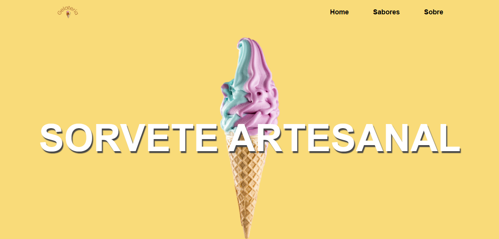

# Página de Sorvetes em React

Bem-vindo ao projeto de Página de Sorvetes em React! Este projeto foi desenvolvido com base nas informações do curso da Devmedia.

## Pré-requisitos

Antes de começar, certifique-se de ter o Node.js e o npm (Node Package Manager) instalados em seu sistema. Você pode baixá-los em [nodejs.org](https://nodejs.org/).

## Instalação

Siga os passos abaixo para configurar e executar o projeto:

1. Clone este repositório do GitHub em sua máquina local:

git clone https://github.com/seuusuario/seurepositorio.git

2. Navegue até o diretório do projeto:

cd nomedoseuprojeto

3. Instale as dependências do projeto com o comando:

npm install

4. Instale o pacote `react-router-dom` para lidar com o roteamento em seu aplicativo React:

npm install react-router-dom

## Executando o Projeto

Após concluir a instalação, você pode iniciar o servidor de desenvolvimento e visualizar o projeto no seu navegador:

npm start

O projeto será executado em [http://localhost:3000](http://localhost:3000). Você pode acessar essa URL no seu navegador para visualizar a página de sorvetes em funcionamento.

## Contribuindo

Se você deseja contribuir para este projeto, fique à vontade para criar pull requests ou abrir issues em nosso repositório no GitHub.

## Licença

Este projeto é distribuído sob a licença [MIT](LICENSE). Sinta-se à vontade para usá-lo e modificá-lo conforme suas necessidades.

---

Divirta-se criando sua página de sorvetes em React! Se tiver alguma dúvida ou precisar de ajuda, sinta-se à vontade para entrar em contato.
